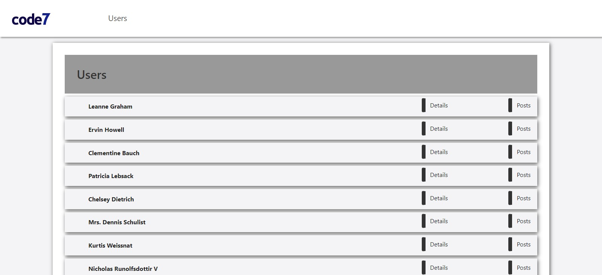
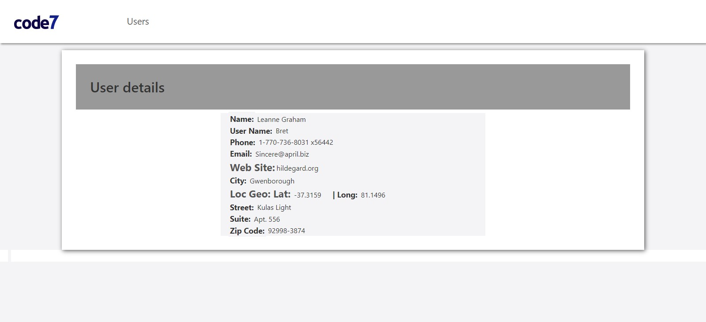
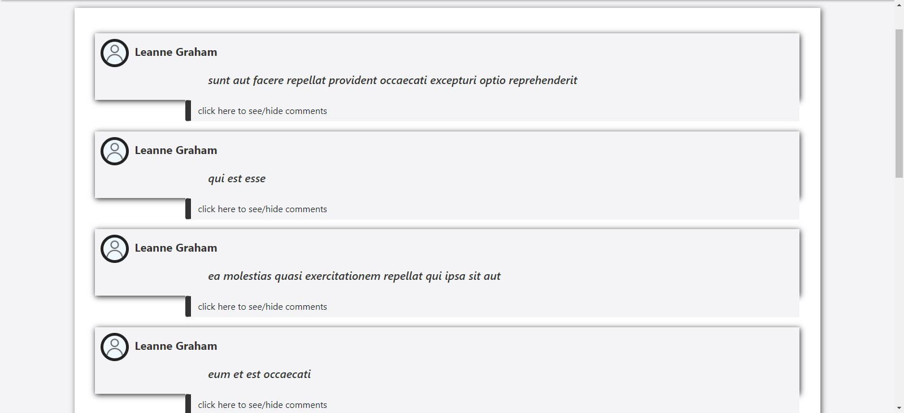
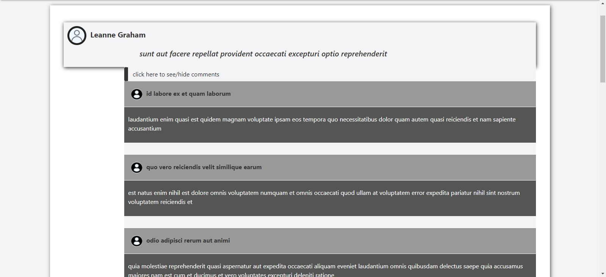

# CODE7 CHALLENGE

##DESAFIO:

####O problema que iremos enfrentar é a exibição estatística dos posts realizados por uma
lista de usuários usando a API fake JSONPlaceholder

###O objetivo desse projeto é a criação de um dashboard que exiba os seguintes dados:

 Dados dos usuários que tiveram posts realizados

 Distribuição de posts por usuários

 Distribuição de comentários em posts por cada usuário

 Ranking dos usuários por posts e comentários(impossivel de implementar ja que os dados de posts e comentarios são iguais para todos os usuarios

 Opções de filtro (não aplicado)

##TECNOLOGIAS USADAS:

###ReactJs, Css, React-Router, React-router-dom, Axios, React.Hooks

##INSTALL/USER

###Clone o repositorio e rode o app

####npm/yar start

###Menu Users para a ação inicial

###Será mostrada a lista de usuários onde você ver os detalhes do usuário ou ir para os posts do usuário

###Nos detalhes você pode acessar a página do usuário ou mesmo sua localização ditamente linkadas

###Menu Nos posstes do usuário você pode ver os postes do usuario e pode abrir os comentarios do poste específico clicando em 'click here to see/hide comments'

###Menu Clicando em 'click here to see/hide comments' serão listados os comentarios do poste especifico

##pedroorf@gmail.com
